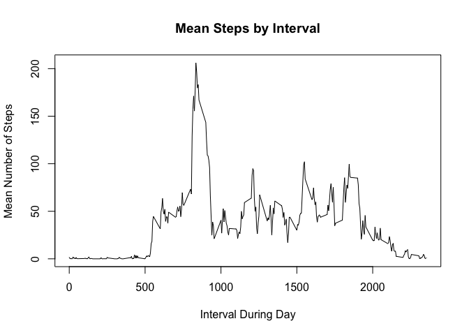
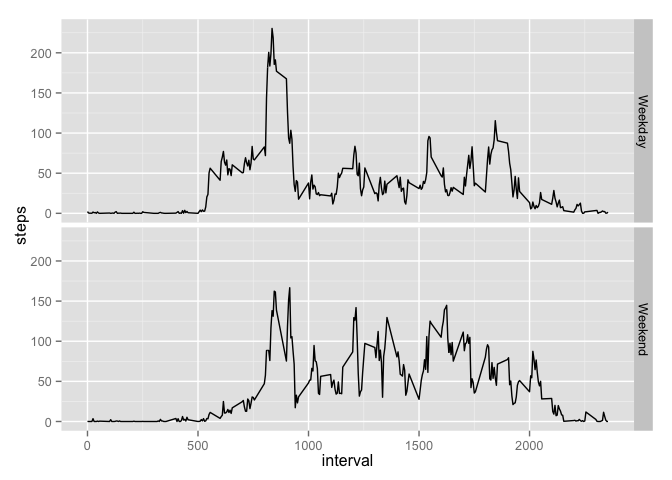

# Reproducible Research: Peer Assessment 1
By: Andrew Thorsen

## Loading and preprocessing the data
Here I read in the data using read.csv, assuming the working directory
is the "RepData_PeerAssessment1" folder.  I convert the date to a 
Date object using as.Date().


```r
activity <- read.csv("activity.csv")
activity$date <- as.Date(activity$date)
```

## What is mean total number of steps taken per day?
1: Calculate the total number of steps taken per day.

I do this by using the aggregate function, summing steps by date.
Note that if a date is not on the list, then that day only had NA values.

```r
totalSteps <- aggregate(steps ~ date, data = activity, FUN = sum)
totalSteps
```

```
##          date steps
## 1  2012-10-02   126
## 2  2012-10-03 11352
## 3  2012-10-04 12116
## 4  2012-10-05 13294
## 5  2012-10-06 15420
## 6  2012-10-07 11015
## 7  2012-10-09 12811
## 8  2012-10-10  9900
## 9  2012-10-11 10304
## 10 2012-10-12 17382
## 11 2012-10-13 12426
## 12 2012-10-14 15098
## 13 2012-10-15 10139
## 14 2012-10-16 15084
## 15 2012-10-17 13452
## 16 2012-10-18 10056
## 17 2012-10-19 11829
## 18 2012-10-20 10395
## 19 2012-10-21  8821
## 20 2012-10-22 13460
## 21 2012-10-23  8918
## 22 2012-10-24  8355
## 23 2012-10-25  2492
## 24 2012-10-26  6778
## 25 2012-10-27 10119
## 26 2012-10-28 11458
## 27 2012-10-29  5018
## 28 2012-10-30  9819
## 29 2012-10-31 15414
## 30 2012-11-02 10600
## 31 2012-11-03 10571
## 32 2012-11-05 10439
## 33 2012-11-06  8334
## 34 2012-11-07 12883
## 35 2012-11-08  3219
## 36 2012-11-11 12608
## 37 2012-11-12 10765
## 38 2012-11-13  7336
## 39 2012-11-15    41
## 40 2012-11-16  5441
## 41 2012-11-17 14339
## 42 2012-11-18 15110
## 43 2012-11-19  8841
## 44 2012-11-20  4472
## 45 2012-11-21 12787
## 46 2012-11-22 20427
## 47 2012-11-23 21194
## 48 2012-11-24 14478
## 49 2012-11-25 11834
## 50 2012-11-26 11162
## 51 2012-11-27 13646
## 52 2012-11-28 10183
## 53 2012-11-29  7047
```
2: Make a histogram of the total number of steps taken each day.


```r
hist(totalSteps$steps, main = "Histogram of Step Total",
     xlab = "Total Number of Steps in a Day",
     ylab = "Number of Days with given Total Steps",
     breaks = 10)
```

 

3: Calculate and report the mean and median of the total number of steps taken per day.


```r
stepmean <- floor(mean(totalSteps$steps))
stepmedian <- median(totalSteps$steps)
```
The mean is: 1.0766\times 10^{4} steps. The median is: 10765.

## What is the average daily activity pattern?
1: Make a time series plot of the 5-minute interval and the average number of steps taken,
averaged across all days.

I use aggregate to get the mean number of steps for each interval.


```r
stepsByInt <- aggregate(steps ~ interval, data = activity, FUN = mean)
plot(stepsByInt$interval, stepsByInt$steps, type = "l",
     main = "Mean Steps by Interval",
     xlab = "Interval During Day",
     ylab = "Mean Number of Steps")
```

 

2: Which 5-minute interval, on average across all the days in the dataset, contains the maximum
number of steps?


```r
maxInterval <- stepsByInt[which.max(stepsByInt$steps),1]
```

The maximum interval for average steps taken is: 835.


## Imputing missing values

1: Calculate and report the total number of missing values in the dataset.


```r
totalNA <- sum(is.na(activity$steps))
```

Out of 17568 data points, 2304 are missing.

2: Devise a strategy for filling in all of the missing values in the dataset.

I will use the suggested strategy of filling in each NA value with the floor of the mean for
that interval over all days that have a recorded value.

3: Create a new dataset that is equal to the original dataset but with the missing data filled in.

I use the method I describe above.  I display the head of the new dataset to
show the replaced values. 

```r
actOriginal <- activity
for(i in 1:17568){
        if(is.na(actOriginal[i,1])){
                activity[i,1]<-floor(stepsByInt[which(stepsByInt$interval==actOriginal[i,3]),2])
        }
}
act2 <- activity
head(act2)
```

```
##   steps       date interval
## 1     1 2012-10-01        0
## 2     0 2012-10-01        5
## 3     0 2012-10-01       10
## 4     0 2012-10-01       15
## 5     0 2012-10-01       20
## 6     2 2012-10-01       25
```

4: Make a histogram of the total number of steps taken each day and Calculate
and report the mean and median total number of steps taken per day. Do these values
differ from the estimates from the first part of the assignment? What is the impace of imputing
missing data on the estimates of the total daily number of steps.


```r
totalSteps2 <- aggregate(steps~date, data = act2, FUN = sum)
hist(totalSteps2$steps, main = "Histogram of Step Total: No Missing Values",
     xlab = "Total Number of Steps in a Day",
     ylab = "Number of Days with Given Step Total",
     breaks = 10)
```

 

```r
stepmean2 <- mean(totalSteps2$steps)
stepmedian2 <- median(totalSteps2$steps)
```
Mean before filling in NAs: 1.0766\times 10^{4}. Mean after filling in NAs: 1.074977\times 10^{4}.

Median before filling in NAs: 10765. Median after filling in NAs: 1.0641\times 10^{4}.

The median and mean drop slightly when filling in NAs. This is likely because I filled
values in with the floor of the means for given intervals, so this would slightly lower
mean estimates. However, the estimate of total daily number of steps increases, because
some values that had no recorded value now have a non-zero number of steps.

## Are there differences in activity patterns between weekdays and weekends?

1: Create a new factor variable in the dataset with two levels - "weekday" and "weekend"
indicating whether a given date is a weekday or weekend day.


```r
dayOfWeek <- weekdays(act2$date, abbreviate = TRUE)
endOrDay <- as.factor(dayOfWeek %in% c("Sun", "Sat"))
levels(endOrDay) <- c("Weekday", "Weekend")
act2$endOrDay <- endOrDay
```

2: Make a panel plot containing a time series plot of the 5-minute interval and the average
number of steps taken, averaged across all weekday days or weekend days.

I create this plot using the ggplot2 package, making the weekend/weekday factor a facet.

```r
ag2 <- aggregate(steps ~ interval + endOrDay, data = act2, FUN = mean)
library(ggplot2)
g <- ggplot(ag2, aes(x = interval, y=steps))+geom_line()+facet_grid(endOrDay ~ .)
g
```

 

